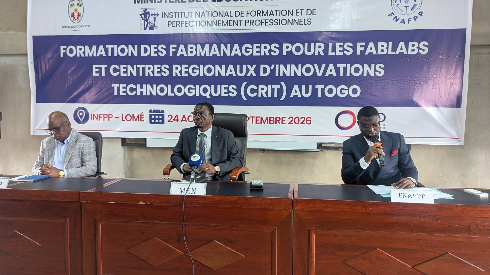

# Journal du 24 Août 2026
**Rédigé par Victorienne ADOKOU**
## Fait aujourd'hui ##
- Participation à la cérémonie d'ouverture de la formation des fabmanagers en présence du MEN SEM. MAMA OMOROU, du directeur de INFPP M. Emile Kossi N'GUISSAN, du chargé du comité de FNAFPP qui nous ont prononcé des mots de bienvenue et d'encouragement ; des directeurs !
centraux , des inspecteurs et des esperts formateurs.


- Prise d'une photo d'ensemble avec le Ministre.


- Installation des logiciels `VS code` et `Git`
- Module sur la documentation : `Git`, `Github`, `VS code` et language de `Marktown` présenté par l'espert formateur KAMEKPO Giovani.
## Appris
1- L'importance de la documentation pour assurer la traçabilité et la réutilisation d'un projot.

2- L'utilisation des logiciels `Git`, `Github`, `VS code` et language de `Markdown` dans la documentation.
## Raté, puis corrigé
- Echec d'intallation du logiciel `Git` → Erreur de configuration → Relancement de l'installation avec de bons paramètres → `Git` installé avec succes.
## Décidé
```Bien documenter son travail avec Markdown et apprendre à utiliser Git pour ne pas perdre ses fichier```.
## À faire demain
- [Apprendre à faire un dépôt sur Github] — Victorienne
- [Rédiger le jounal de demain] — Victorienne 