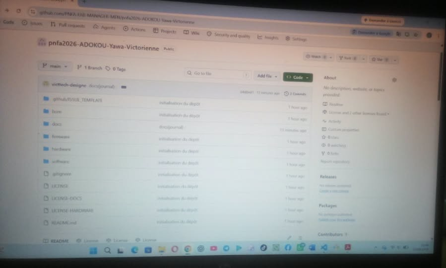
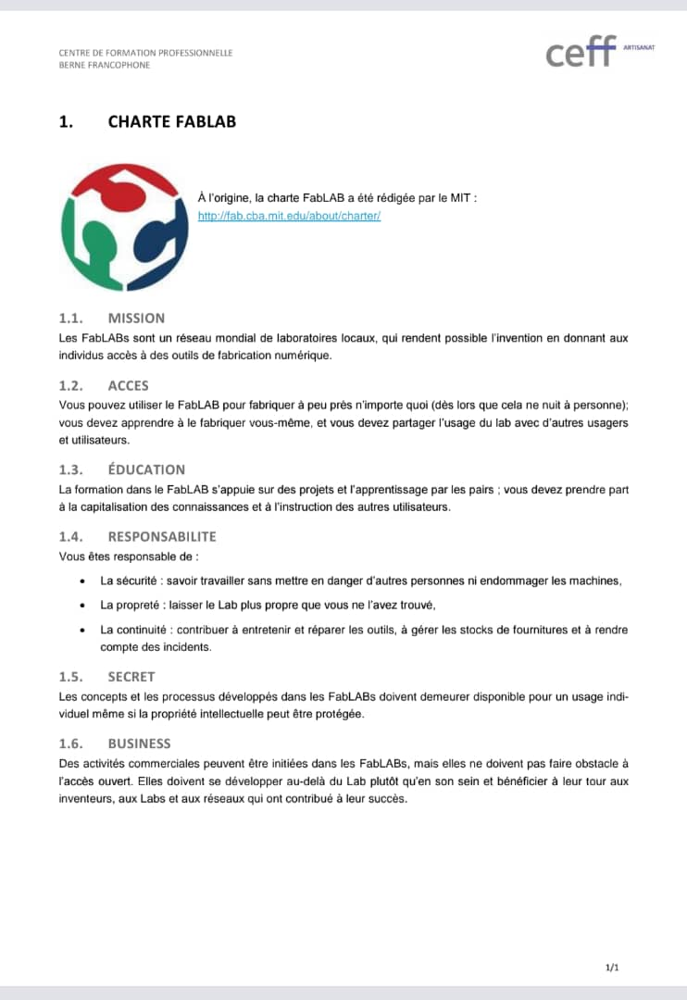

# Journal du 25 Août 2026
**Rédigé par Victorienne ADOKOU**
## Fait aujourd'hui ##
- Suite du module sur la documentation: déposition sur `Github`[Paramètre : 1 dépôt utilisé, 1 commit effectué]

- Reception et acceptation de l'invitation de collaboration sur un repo Github PNFA-FAB-MANAGER-MEN. [Paramètre : 1 invitation acceptée]
- Module sur la découverte des fablabs :  présentation de la charte internationnale des fablabs; des inventaires de référence et des réseaux de fablabs présenté par l'expert formateur M. Sylvestre OLANLO. [Paramètre : 1 charte étudié, 6 principes retenus, 2 réseaux étudiés]

## Appris
1- Accepter une invitation de collaboration et faire un dépôt sur `Github`

2- Un fablab est un lieu ouvert à tout le monde pour prototyper, fabriquer et partager avec des machines numériques.

3- La Charte internationale des Fablabs définit 6 principes : mission, accès, éducation, responsabilité, confidentialité,  activité commerciale.

4- Les inventaires de référence servent à lister les machines et outils standards d’un Fablab.

5- Les réseaux de Fablabs ( **Reffao**, **RTFLabs ) permettent l’échange de savoirs entre les laboratoires du monde entier.
## Raté, puis corrigé
Photo introuvable dans le journal →  Mauvais chemin medias/ au lieu de ../medias/ → Correction du lien de la photo → Photo affichée dans le journal.
## Décidé
- > "Faire, échouer, apprendre, recommencer : c’est ça l’esprit Fablab."
- Accepter les invitations de collaboration.    
- Documenter chaque projet avec markdown et git  pour assurer la traçabilité.
- Respecter les 6 principes de la Charte des Fablabs dans nos travaux.
## À faire demain
- [Faire un premier commit sur le repo collaboratif du formateur] — Victorienne 
- [Rédiger le jounal du 26 Août 2026<!<>:>] — Victorienne