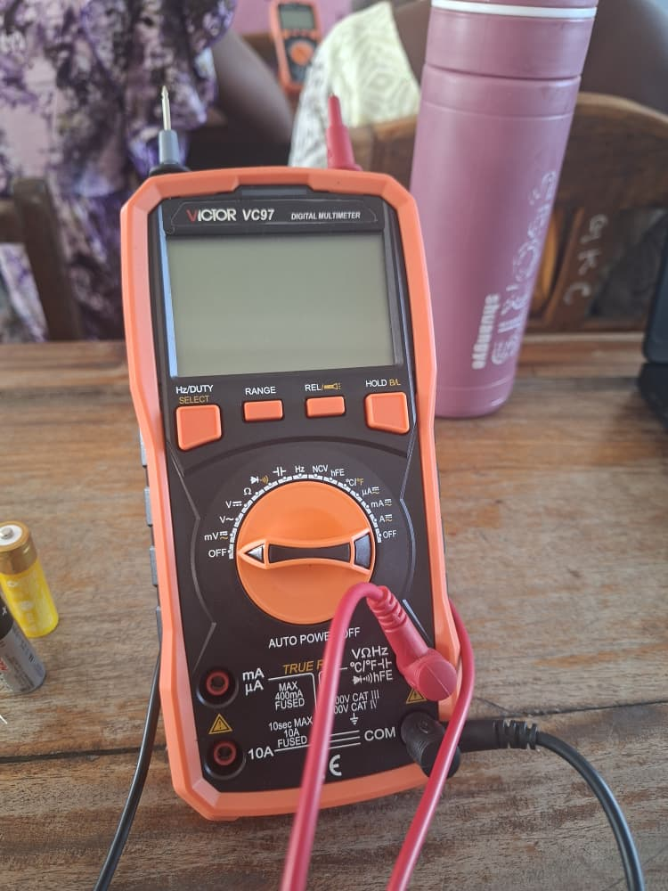

# Journal du 26 Août 2026
**Rédigé par Victorienne ADOKOU**
## Fait aujourd'hui ##
- Parcours des 4 ateliers du Fablab.
- **Atélier 1 - Découpe laser** : Découverte des machines de la découpe et leurs caractéristiques.

- **Atelier 2 - Electronique** : Les bases de l'électronique; Mésure de la tension des piles et des résistance avec un multimètre; présentation d'un `breadbord`

- **Atelier 3 - Impression 3D** : Principes généraux de l'impression 3D présentation des logiciels de modélisation : `Fusion` 360  et des imprimantes 3D.

- **Atelier 4 - salle projet** : Analyse de certains projets presentés par des collègues.

## Appris
- La découpe laser.
- L'utilisation d'un multimètre pour mésurer la tension, l'intensité et la capacité.
- Filaments de base des imprimantes 3D : PLA, PLA+, PETG, ABS

## Raté, puis corrigé

## Décidé
- Prendre une photo de chaque réglage qui marche pour avoir une trace visuelle.
- Toujours vérifier les paramètres du fichier avant de lancé la découpe.

## À faire demain
- [Déterminer les entrées et sorties en électronique] — Victorienne
- [Rédiger le jounal du 27 Août 2026] — Victorienne