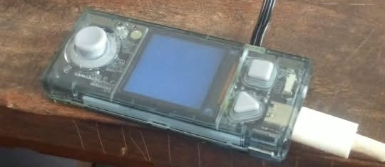

# Journal du 27 Août 2026
**Rédigé par Victorienne ADOKOU**
## Fait aujourd'hui 
- Utilisation de Bambu studio, Pruce slicer.
- Entrée et sortie en électronique, identification descomposants du `CyberPi`

- Réalisation d'une veilleuse automatique.

- Les paramètres clés de la découpe laser : **la puissance et la vitesse**
## Appris
- Utilisation d'une plateau chauffante évite le warping en impression 3D.
- Un capteur mésure une grandeur physique de l'environnement et la transforme en information numérique.
- Un actionneur reçoit une commande du programme et agit sur le monde physique.
- La découpe laser utilise une vitesse lente et une puissance forte tandis que le gravé utilise une vitesse élevée et une puissance faible.
## Raté, puis corrigé
- La veilleuse automatique ne réagissait pas → code erroné → code corrigé → veilleuse allumlée.
## Décidé
- Identifier clairement les entrées et sorties avant de brancher un composant au CyberPi.
- Vérifier le nivellement du plateau et la propreté de la surface avant chaque impression 3D.
## À faire demain
- [Reprendre la modélisation sur Bambu studio] — Victorienne
- [Rédiger le jounal du 28 Août 2026] — Victorienne
