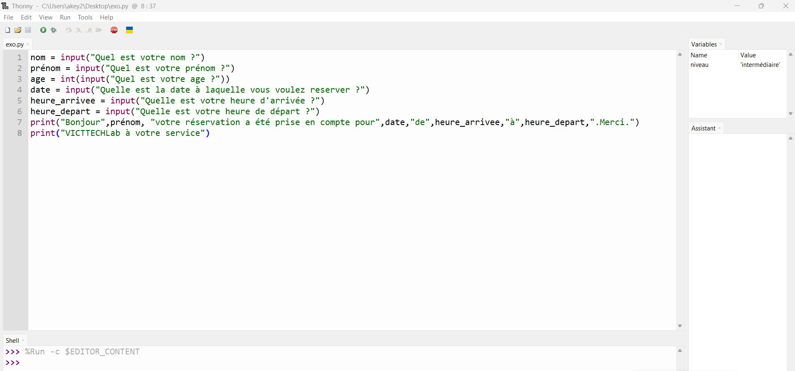

# Journal 3 septembre 2026 (rédigé par : Victorienne ADOKOU)
## Fait aujourd'hui
- Informatique : Installation de Python et Thonny sur PC [paramètre : 2 logiciels installés] en anglais de préférence
- Prise en main Thonny : Utilisation de print() pour afficher du texte [paramètre : 1 fonction vue]
- Bases Python : Syntaxe des commentaires #, des indentations, et règles de nommage des variables [paramètre : 3 règles vues]
- Types de variables : int, float, str, bool + types composés : list, tuple, dict [paramètre : 8 types vus]
- Exercice pratique : Formulaire de réservation Fablab : nom, prénom, âge, heure et jour d’entrée, heure de sortie [paramètre : 1 programme réalisé] 

- Projet : Étude des composants du projet EDUCONTROL : ESP32, écran LCD 20x4, BMS, RTC, convertisseur, bouton SOS, buzzer, interrupteur On/Off, capteur d’empreinte 307 [paramètre : 9 composants listés]
- Projet : Étude des différentes broches de chaque matériel [paramètre : 1 tableau de brochage étudié]

## Appris
- print() sert à afficher du texte dans Thonny. Le texte doit être entre guillemets " "
- Un commentaire commence par #. L’indentation = espace en début de ligne, importante en Python
- = affecte une valeur à une variable. Ne jamais mettre d’espace dans le nom d’une variable
- Types simples : int = nombre entier, float = nombre décimal, str = chaîne de caractères, bool = Vrai/Faux
- Types composés : list = liste, tuple = tuple, dict = dictionnaire

## Raté, puis corrigé
- [Erreur : espace dans le nom d’une variable] -> [cause : non respect de la règle de nommage Python] -> [solution : renommer la variable sans espace avec _] -> [programme exécuté sans erreur]

## Décidé
- Utiliser Python + Thonny pour tous les prochains programmes de test 
- Retenir la liste des 9 composants pour le projet V1 [paramètre : 9 composants]
- Faire le brochage complet de l’ESP32 et des périphériques avant câblage [paramètre : 1 étape obligatoire]

## À faire demain
- Coder le formulaire de réservation avec vérification des données [paramètre : 1 amélioration] - Victorienne
- Commencer le câblage test de l’ESP32 avec l’écran LCD 20x4 [paramètre : 1 test] - Victorienne
- Créer un schéma des connexions des 9 composants du projet [paramètre : 1 schéma] - Victorienne
- Rédiger le journal du 04/09/2026 [paramètre : 1 journal] - Victorienne