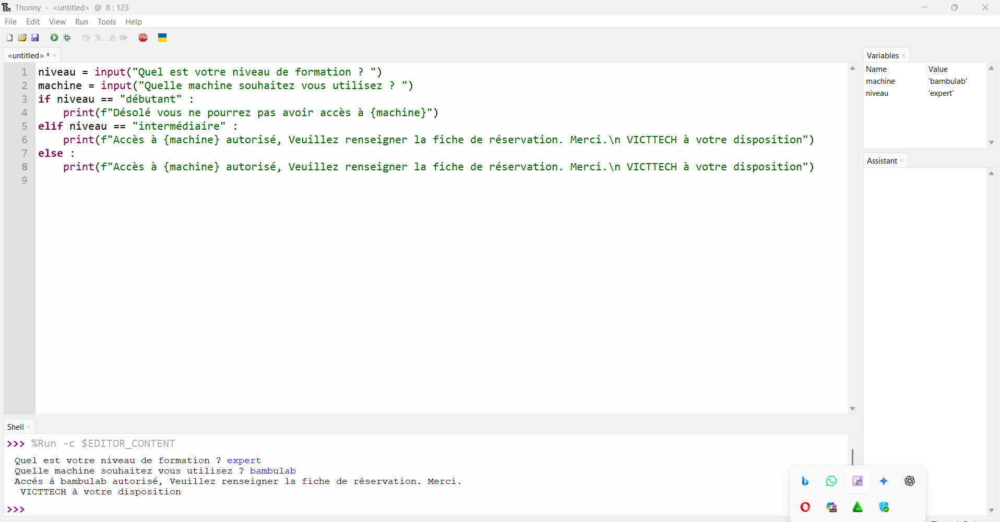

# Journal 2026 (rédigé par : Victorienne ADOKOU)

## Fait aujourd'hui
- Python Thonny : Étude des structures de contrôle et opérateurs 
    - Opérateurs : / division réelle, // division entière, % reste, *_ puissance
    - Comparaison : == égal, != différent, >= supérieur ou égal
    - Logique : and et, or ou, not non
    - Condition : if, elif, else
    - Boucle : for
- Exercice : Contrôle d’accès Fablab selon niveau : débutant = pas d’accès, intermédiaire/expert = accès [paramètre : 1 programme if/elif/else] 

- PCB : Étude de la fabrication des PCB - Printed Circuit Board [paramètre : 1 plaque étudiée]
- Ancien procédé : Manuel avec perchlorure de fer, papier glacé et fer à repasser
- Nouveau procédé : Numérique avec machine de gravure [paramètre : Puissance 100, Vitesse 800, Passes 15, Fréquence 30]

## Appris
- Les opérateurs Python permettent de faire des calculs et des comparaisons précises : / // % _*
- Les opérateurs logiques and, or, not servent à combiner plusieurs conditions dans un if
- Un PCB relie électriquement les composants sans câblage manuel. Résultat : circuit plus compact, fiable et reproductible
- La gravure numérique d’un PCB se règle avec 4 paramètres : Puissance, Vitesse, Nombre de passes, Fréquence

## Raté, puis corrigé
- [Erreur : condition if mal écrite avec = au lieu de ==] -> [cause : confusion affectation vs comparaison] -> [solution : remplacer par ==] -> [programme de contrôle d’accès fonctionnel]

## Décidé
- Utiliser if, elif, else pour toute gestion d’accès et de niveau dans le projet [paramètre : 1 structure retenue]
- Passer à la fabrication de PCB par gravure numérique avec les paramètres : P=100, V=800, Passes=15, F=30 [paramètre : 4 réglages]

## À faire demain
- Fabriquer un premier PCB test avec la machine de gravure [paramètre : 1 PCB] - Victorienne
- Améliorer l’exercice d’accès Fablab avec plus de niveaux et de messages [paramètre : 1 version 2] - Victorienne
- Tester l’envoi de données de l’ESP32 vers l’écran LCD [paramètre : 1 test] - Victorienne
- Rédiger le journal du 05/09/2026 [paramètre : 1 journal] - Victorienne
