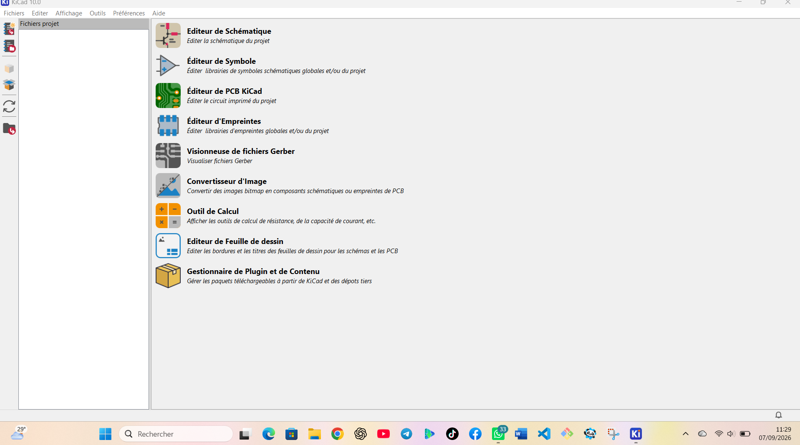

# Journal du 7 septembre 2026 # (rédigé par : Victorienne ADOKOU)  

## Fait aujourd'hui ##
- Installation logiciel `Kickard` pour la conception PCB [paramètre : 1 logiciel installé]

- Cours : Initiation au PCB présentée par l’expert M. Arnaud
- Réalisation d’un schéma avec 2 résistors, 1 LED, 1 transistor, 1 LDR, 1 batterie [paramètre : 5 composants]

- Création du PCB à partir du schéma réalisé [paramètre : 1 carte conçue] 

## Appris ## 
- Le PCB est le cœur d’un circuit électronique
- Pourquoi passer du breadboard au PCB : Le breadboard est sensible aux vibrations, difficile à dupliquer. Le PCB donne : réduction de taille, câblage solide, connexions répétables, fabrication en plusieurs exemplaires [paramètre : 4 avantages]
- Anatomie d’un PCB : Substrat, cuivre, solder mask, silkscreen, pads, vias, trous de fixation [paramètre : 7 éléments]
- Méthode : Il faut toujours réaliser le schéma électronique avant de dessiner la carte

## Raté, puis corrigé ##
- [Erreur : confusion entre breadboard et PCB au début] -> [cause : on pensait que breadboard suffisait] -> [solution : explication de M. Arnaud sur les limites du breadboard] -> [résultat : choix de passer sur PCB]
 
 ## Décidé## 
 - Utiliser Kickard pour tous les futurs designs PCB [paramètre : 1 logiciel de référence] 
 - Toujours faire le schéma avant le PCB pour éviter les erreurs 

 ## À faire demain##
 - Router les pistes du PCB conçu aujourd’hui [paramètre : 1 carte à router] - Victorienne
 - Rédiger le journal du 07/09/2026 [paramètre : 1 journal] - Victorienne